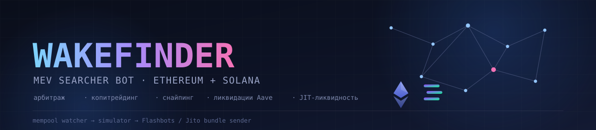
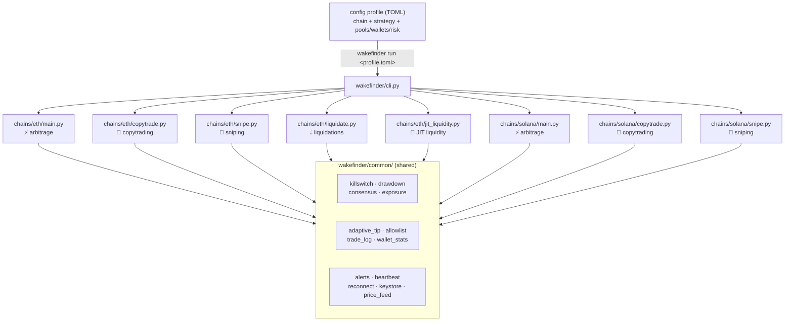

<p align="center">
  
</p>

<p align="center">
  <a href="README.md">Русский</a> ·
  <a href="README.en.md"><strong>English</strong></a>
</p>

<p align="center">
  <a href="https://github.com/deuteriumZzz/Wakefinder/actions/workflows/ci.yml"></a>
  
  
  
  
  
  
</p>

A standalone MEV searcher bot (mempool watching → AMM simulation → bundle
submission via Flashbots/Jito) for Ethereum and Solana. Independent from
BitbotBY — this project is on-chain, BitbotBY is CEX/ccxt.

> ⚠️ **This is a trading bot that moves real money.** Before entering mainnet
> keys, read the [Security](#security) and [Quick Start](#quick-start-from-zero-to-first-run) sections in full,
> and complete the testnet check (step 6). What to do when the kill switch/drawdown
> circuit breaker fires — [RUNBOOK.md](RUNBOOK.md). A step-by-step path from install to real capital — [GOING_LIVE.md](GOING_LIVE.md).

## Table of Contents

- [Strategies](#strategies)
- [Architecture](#architecture)
- [Quick Start](#quick-start-from-zero-to-first-run)
- [Config Profiles and CLI](#config-profiles-and-cli)
- [Portfolio Risk Control](#portfolio-risk-control-all-processes-all-5-strategies-both-chains)
- [Infrastructure Reliability](#infrastructure-reliability-tier-1-2)
- [CI and Containerization](#ci-and-containerization-tier-3)
- [Backtesting](#backtesting-tier-4)
- [Operational Requirements](#operational-requirements-ethereum-path)
- [Security](#security)
- [Quant Hardening](#quant-hardening-both-chains)
- [Strategies — Implementation Details](#strategies--implementation-details)
- [Observability and Dashboard](#observability)
- [Dry-Run Mode](#dry-run-mode-dry_runtrue)
- [Development](#development)

## Strategies

5 strategies, each its own process/wallet (sniping runs on both chains,
liquidations and JIT liquidity are ETH-only):

| | Ethereum | Solana |
|---|---|---|
| ⚡ **Arbitrage** | `wakefinder/chains/eth/main.py` | `wakefinder/chains/solana/main.py` |
| 🐋 **Copytrading** | `wakefinder/chains/eth/copytrade.py` | `wakefinder/chains/solana/copytrade.py` |
| 🎯 **New-pool sniping** | `wakefinder/chains/eth/snipe.py` | `wakefinder/chains/solana/snipe.py` |
| 💧 **Liquidations (Aave V3)** | `wakefinder/chains/eth/liquidate.py` | — |
| 🧊 **JIT liquidity (Uniswap V3)** | `wakefinder/chains/eth/jit_liquidity.py` | — |

Switching strategies isn't a toggle inside one running process — it's the
`strategy` choice in a TOML profile (`wakefinder run configs/<profile>.toml`,
see [Config Profiles and CLI](#config-profiles-and-cli) below). Each profile launches its own
process, so you can keep several strategies running in parallel (on
separate wallets).

## Architecture



Each process (regardless of strategy) is an independent
watcher→simulator→sender pipeline (`common/interfaces.py`:
`MempoolWatcher`/`Simulator`/`BundleSender`, not tied to a specific chain).
Shared infrastructure (risk control, logging, alerts) is reused via
`common/`, but **every process must have its own wallet** — sending
transactions from the same wallet in parallel from different processes
breaks nonce accounting. This isn't just a recommendation:
`wakefinder/common/wallet_lock.py` (`acquire_wallet_lock`) grabs a file
lock keyed on the wallet address at the start of every `run()` — a second
process with the same wallet refuses to start with a clear error
(`WalletAlreadyRunningError`) instead of random "nonce too low"/"replacement
transaction underpriced" failures hours into a run. Deliberately NOT a
nonce coordinator that would make sharing safe — even without a nonce
conflict, a shared wallet means shared risk across all strategies at once;
one wallet per strategy remains the right call.

**What we trade through** (an architectural decision, not a config
setting): on Ethereum — Uniswap V2 and compatible forks (Sushiswap) via
direct router calls; on Solana — the [Jupiter](https://jup.ag) aggregator,
not our own encoding of a specific DEX's instructions (Raydium/Orca involve
too many PDA derivations to trust without devnet verification). This is
hardcoded in `chains/eth/abi.py`/`sender.py` and `chains/solana/*.py` — not
a config parameter.

**Multi-chain coverage**: adding another EVM chain (BSC/Arbitrum/Base/...)
is cheap — copy `chains/eth/` almost 1:1, swap the router/factory/WETH
addresses and RPC URL, since most such chains run forks of the same Uniswap
V2 ABI. A non-EVM chain other than Solana would be a full new chain module
built from scratch, the way Solana was. Neither is implemented today — only
architecturally ready.

## Quick Start: From Zero to First Run

### 1. Install

```bash
git clone <this repository>
cd Wakefinder
pip install -e ".[dev]"
```

### 2. Set up a dedicated wallet

**Never use your main wallet.** Create a new one, ONLY for the bot:
- Ethereum: any standard method (MetaMask → "Create Account", `eth_account.Account.create()` in Python, `cast wallet new` from Foundry) — you need a hex private key (`0x...`).
- Solana: `solana-keygen new` (Solana CLI) or Phantom/Solflare → "Create New Wallet" → export the private key (base58).
- Keep a **minimal balance** on it, sweep profits to a cold wallet regularly.
- Ethereum arbitrage needs YET ANOTHER separate key — `FLASHBOTS_SIGNER_KEY`, used only for relay reputation, never funded.
- Store the secret either as plaintext in `.env` (simpler, start here) or via the encrypted keystore — see [Security](#security) below.

### 3. Get RPC access

- **Ethereum**: you need BOTH — a WS endpoint (mempool subscription) and an HTTP endpoint that supports `eth_getRawTransactionByHash` (not every provider offers this — check the provider's docs; the bot fails loudly if it's missing). Options: [Alchemy](https://alchemy.com), [Infura](https://infura.io), [QuickNode](https://quicknode.com) — all have free tiers; real trading usually needs a paid tier for speed/limits.
- **Solana**: also WS + HTTP. Options: [Helius](https://helius.dev), [QuickNode](https://quicknode.com), [Triton](https://triton.one). The public `api.mainnet-beta.solana.com` isn't suitable for production (hard rate limits).
- **Testnet is mandatory before real money**: Ethereum Sepolia (RPC — same providers, separate endpoint; ETH from a faucet, e.g. `sepoliafaucet.com`), Solana devnet (`solana airdrop` via CLI or `solfaucet.com`).

### 4. Find what to watch

- **Pools for arbitrage**: you need the target pool's address AND a reference pool address for the SAME pair on a DIFFERENT DEX (no arbitrage without a second liquidity source). Ethereum — [Etherscan](https://etherscan.io) (pair contract tab) or [Dexscreener](https://dexscreener.com); Solana — [Solscan](https://solscan.io), [Dexscreener](https://dexscreener.com), the Raydium/Orca sites.
- **Wallets for copytrading**: the chain itself doesn't label addresses as "smart" — sources:
  - Manual/external analytics: [Nansen](https://nansen.ai), [Arkham](https://arkham.com), [DeBank](https://debank.com), Etherscan "Top Accounts".
  - Our own `wakefinder/wallet_scanner.py` — a cheap first filter: `find_candidate_wallets_eth`/`find_candidate_wallets_solana` find who traded in the pools you care about and how often (same RPC, no new data source); optionally `filter_by_etherscan_activity` filters out fresh/one-off addresses. This is a candidate list, not a final verdict — final curation is still on you or an external analytics tool.

### 5. Configure secrets and a profile

```bash
cp .env.example .env   # fill in RPC URLs/keys — never commit .env
```

Then copy and edit a suitable profile from `configs/` (addresses inside are
placeholders, replace with the ones from step 4):

```bash
cp configs/eth-copytrade-conservative.toml configs/my-profile.toml
# edit watched_wallets, token_denylist, risk parameters
```

For the profile format and how to switch strategies/speed modes, see [Config Profiles and CLI](#config-profiles-and-cli) below.

### 6. Test on testnet

Switch `.env` to testnet RPC/keys (Sepolia/devnet), run with minimal
capital, confirm the whole cycle (detection → simulation → send → log)
actually works before touching mainnet capital. This is the one step the
bot cannot verify for you.

### 7. Go live

Testnet (step 6) verifies the pipeline works at all — it does NOT verify
that THIS SPECIFIC config (real watched_wallets/pools/risk parameters)
makes good decisions in the real market. Before the first run of a new
profile on mainnet capital, add `DRY_RUN=true` to `.env` — all decision
logic runs normally on real data, but the actual on-chain send is skipped
(see [Dry-Run Mode](#dry-run-mode-dry_runtrue) below). After watching the logs/dashboard and
confirming the bot decides what you expect, remove `DRY_RUN`.

```bash
wakefinder run configs/my-profile.toml
```

(or `python -m wakefinder.cli run configs/my-profile.toml` if you skipped `pip install -e .`)

### 8. Monitor

```bash
python -m wakefinder.dashboard              # open positions + wallet stats
python -m wakefinder.common.killswitch status
```

Set `TELEGRAM_BOT_TOKEN`/`TELEGRAM_CHAT_ID` in `.env` for alerts. When the
kill switch/drawdown/other protections fire — see [RUNBOOK.md](RUNBOOK.md).

## Config Profiles and CLI

`wakefinder/cli.py` is a single entry point over TOML profiles instead of
hardcoded launcher scripts per chain+strategy combination.

```bash
wakefinder run configs/eth-arb.toml
wakefinder run configs/eth-copytrade-fast-memecoin.toml
```

A profile (see examples in `configs/`) sets:
- `chain` (`"eth"`/`"solana"`) and `strategy` (`"arb"`/`"copytrade"`/`"snipe"`/`"liquidate"`/`"jit"`, the last two ETH-only) — which `run()` to call;
- `[[pools]]`/`[[reference_pools]]`/`[[solana_pools]]` — pools (format differs per chain, see examples);
- `watched_wallets`, `token_allowlist`, `token_denylist` — address lists;
- `[risk]` — overrides for `Settings` risk parameters (full key list — `_RISK_ENV_MAP` in `cli.py`), applied via environment variables BEFORE the config is first read in-process;
- `kill_switch_file` (optional) — see "Selective shutdown" below.
- `live_config_file` (optional) — a dedicated live-config file for this
  profile, see "Live Config"; without it, all processes share one file.

**One process = one profile** — the same assumption as the per-strategy wallet/process separation above.

### Finding candidates for watched_wallets

`wakefinder discover` is a CLI wrapper over `wallet_scanner.py`, not
scattered functions you had to call from Python by hand:

```bash
wakefinder discover --chain eth --pools 0xPOOL1 0xPOOL2 --from-block 21000000 --to-block 21010000 --top 20
wakefinder discover --chain solana --pools 0xVAULT1 --limit 1000
```

Prints candidates ranked by trading frequency and a ready-to-paste
TOML snippet for `watched_wallets` — copy-paste into a profile, not
auto-written (TOML has no standard writer in stdlib, and silently
overwriting someone's config file is a bad idea on its own).
`--etherscan-api-key` is the same optional activity filter as
`filter_by_etherscan_activity`.

### Selective shutdown: several profiles at once

The global kill switch (see "Portfolio Risk Control") stops ALL Wakefinder
processes at once (any strategy, any chain) — intentional for an emergency,
but inconvenient if you only want to stop today's strategy while leaving
the rest running. A profile can define its own independent kill switch:

```toml
kill_switch_file = "~/.wakefinder_kill_eth_fast_memecoin"
```

If not set, the process uses the shared one (unchanged behavior). With a
dedicated path you can control just that profile:

```bash
python -m wakefinder.common.killswitch stop --path ~/.wakefinder_kill_eth_fast_memecoin
```

This does not disable the global kill switch — it still stops everything
at once, regardless of whether a process also has its own dedicated path.

### Memecoin profile: keeping pace with whales

`configs/eth-copytrade-fast-memecoin.toml` is **not a new strategy or new
code** — the same `chains/eth/copytrade.py` as the conservative profile,
just different risk numbers. The one genuinely large speed lever fully
under our control is the consensus window:

| Parameter | Conservative | Fast (memecoin) | Why |
|---|---|---|---|
| `copytrade_min_consensus_wallets` | 3 | 1 | waiting for a second whale means handing the price move to those who didn't wait |
| `copytrade_consensus_window_seconds` | 180 | 5 | irrelevant at `wallets=1`, but a safe default |
| `copytrade_size_pct` | 2% | 0.5% | smaller per trade — the price of higher speed risk |
| `copytrade_stop_loss_check_interval_seconds` | 60 | 5 | memecoins are more volatile — once a minute is too rare |
| `min_reference_liquidity_eth` | 1.0 | 0.1 | fresh memecoin pools are usually thinner than the default threshold |

The rest of the pipeline (detecting pending tx, broadcasting to the public
mempool) is already as fast as it can be without colocation/private order
flow — deliberately out of scope for this project (see [Security](#security)).

**Checklist before running a memecoin profile for real** (operational
responsibility, not a technical bug):
- [ ] `token_denylist` is manually populated with known fee-on-transfer/rebasing tokens you might trade through whitelisted pairs — far more common with memecoins than blue chips.
- [ ] You understand that lowering `MIN_REFERENCE_LIQUIDITY_ETH`/`_SOL` directly weakens the price-manipulation guard ("Infrastructure Reliability" section), not a free option.
- [ ] `copytrade_max_total_exposure_pct` is set knowing memecoin positions can go to zero (rug pull) — a stop-loss doesn't protect against a pool losing all liquidity.
- [ ] The arbitrage profile does NOT work for memecoins — a fresh token usually has no second liquid pool on another DEX, and without one there's no arbitrage by construction.

## Portfolio Risk Control (all processes, all 5 strategies, both chains)

- **Single kill switch** (`wakefinder/common/killswitch.py`) — every
  process checks ONE file (an absolute path in the home directory by
  default, independent of the process's working directory). Control:
  ```bash
  python -m wakefinder.common.killswitch stop     # stop everything
  python -m wakefinder.common.killswitch resume    # release
  python -m wakefinder.common.killswitch status
  ```
- **Drawdown circuit breaker** (`wakefinder/common/drawdown.py`) —
  independent of `MAX_CONSECUTIVE_FAILURES` (which only catches "bundle
  didn't land"), sums REALIZED profit/loss across all strategies on one
  chain over a rolling window (`DRAWDOWN_WINDOW_SECONDS`, default 24h),
  plus an UNREALIZED mark of all open copytrade positions at check time
  (copytrade entrypoints re-value positions via a live RPC/quote call and
  pass the number into `check_drawdown(unrealized_pnl=...)`), and itself
  engages the kill switch once `MAX_DRAWDOWN_ETH` / `MAX_DRAWDOWN_SOL` is
  exceeded.
- Both implement Tier 0 of the architecture audit; the third Tier 0 item —
  real testnet/devnet validation — can't be done automatically, it needs
  funded test wallets and a live RPC provider (see "Quick Start" step 6).
- **Cross-strategy token exposure cap** (`wakefinder/common/exposure.py`,
  `MAX_TOKEN_EXPOSURE_ETH`/`MAX_TOKEN_EXPOSURE_SOL`, off by default):
  `copytrade_max_total_exposure_pct`/`snipe_max_concurrent_positions` each
  cap exposure ONLY within their own strategy/position file — if copytrade
  and sniping (usually different wallets) both happen to pick up a position
  in the same token, the combined risk on it is invisible anywhere. A
  rug/dump of that token hits both positions at once. The check before
  every entry sums `entry_amount_in` across both strategies for the same
  token — the threshold is absolute (native chain units), not a % of some
  single balance, since the strategies use different wallets.
- **Stuck-position detection** (`wakefinder/common/stuck_position.py`,
  `STUCK_POSITION_THRESHOLD`, default 5): the background price-check loop
  (`_stop_loss_loop`/`_trailing_stop_loop` in all 4 copytrade/snipe
  entrypoints), on a price-quote failure (`getAmountsOut`/Jupiter `quote()`
  raising — usually a rug or dried-up liquidity), used to silently
  `continue` and hold such a position indefinitely without signaling
  anything. Now N consecutive failed attempts (a threshold) flip the
  position to a "stuck" state: one Telegram alert, a `stuck: true` field
  saved to the positions file and highlighted on the web dashboard (red row
  + ⚠ icon). This is NOT a separate exit trigger — trailing-stop/stop-loss
  can't fire if the price can't be read, so a stuck position stays open
  until manual intervention (or until liquidity returns, at which point the
  position automatically leaves the stuck state).
- **Position reconciliation after a crash/restart** (`wakefinder/common/position_reconciliation.py`):
  two independent improvements. (1) In `chains/eth/snipe.py`, a buy used to
  be saved to `positions.json` AFTER the separate `approve` transaction —
  if the process crashed between the confirmed buy and the `approve`, the
  position permanently fell out of stop-loss/dashboard/exposure limits
  without any signal. It's now saved IMMEDIATELY after the confirmed buy
  (`approved` field temporarily `false`, updated afterward). (2) At STARTUP
  of each of the 4 processes, positions from the file are reconciled
  against the REAL on-chain wallet balance — if the recorded token amount
  isn't actually on the wallet (a third-party sale, a race with another
  process, etc.), one Telegram alert with the discrepancy details, the file
  itself isn't touched automatically. HONEST BOUNDARY: the reverse case — a
  position that never made it into the file at all (not the scenario just
  described) — is not recovered automatically: `trade_log.py` stores
  `pool_address`, not the token address, so reconstruction would be a
  guess, not a fact.

<details>
<summary><strong>Staged capital ramp-up (canary)</strong></summary>

`wakefinder/common/canary.py` mirrors the drawdown circuit breaker: that
one stops trading on losses, this one gradually RAMPS UP position size
while there are none. Off by default (`CANARY_START_FRACTION=1.0` — full
size immediately, behavior unchanged unless you explicitly enable it in a
profile).

When enabled (`CANARY_START_FRACTION < 1.0`): `max_capital_per_bundle_eth/sol`
and `copytrade_size_pct` start at the given fraction and grow linearly to
100% as `CANARY_RAMP_TRADES` confirmed (`included`) trades accumulate — by
actual live attempt count, not by time. Works on top of an already-running
process: `CanaryController` keeps the original config values and, on every
check (the same timer as drawdown), rescales from the original each time,
not from the already-reduced current value.

Useful the first time you run a new `watched_wallets` set or a new pair you
don't yet want to trust with full size on the very first trade.

</details>

## Infrastructure Reliability (Tier 1-2)

- **Reference-pool manipulation guard** (`MIN_REFERENCE_LIQUIDITY_ETH` /
  `_SOL`, default 1 ETH / 10 SOL) — a thin reference pool is cheap to move
  in the same block/slot as the target, feeding the bot a fake profitable
  quote; the simulator on both chains refuses to trust pools below the
  threshold.
- **WS auto-reconnect** (`wakefinder/common/reconnect.py`) — all 4
  watchers are wrapped in `with_reconnect`, which catches a dropped
  connection (provider restarts a node, a network blip) and reconnects
  with exponential backoff instead of crashing the whole process.
- **Heartbeat** (`wakefinder/common/heartbeat.py`) — every process writes a
  timestamp to its own file in `HEARTBEAT_DIR` every
  `HEARTBEAT_INTERVAL_SECONDS` (default 30s). Catches a silent event-loop
  hang that raises no exception (so neither the kill switch nor
  `with_reconnect` catches it). External check:
  ```bash
  python -m wakefinder.common.heartbeat eth_arb.heartbeat 90
  ```
- **Process supervision** (`deploy/systemd/*.service`) — systemd unit
  templates with `Restart=always` for all 8 processes (5 strategies,
  ETH+Solana where applicable). Deliberately not implemented in Python —
  process supervision is the OS/init system's job, not the bot's. Each unit
  already calls `wakefinder run configs/<profile>.toml` — edit the TOML
  profile itself (pools/watched_wallets/risk) for production values, not
  `ExecStart`.

## CI and Containerization (Tier 3)

- **CI** (`.github/workflows/ci.yml`) — runs the full pytest suite and
  `py_compile` over the whole package on every push/PR.
- **Docker** (`Dockerfile`) — one image for all processes/strategies, the
  specific module is chosen by the command in `docker run` (see the
  comment in the file).
- Incident runbook — [RUNBOOK.md](RUNBOOK.md).

## Backtesting (Tier 4)

Across all 5 strategies, both chains.

<details>
<summary>Expand</summary>

**ETH** — `wakefinder/backtest.py`: `run_backtest(w3, target_router,
reference_pools, from_block, to_block)`. Not a new data source: the same
`ETH_RPC_HTTP_URL` as live mode — scans historical `Swap` logs of the
target pools via `eth_getLogs`, reconstructs a `PendingSwap` for each and
runs it through the LIVE `TwoPoolArbSimulator.simulate()` (the same code
that actually trades, not a copy of the logic) against the reserves BEFORE
that historical swap.

Honest limitations:
- Public RPCs cap the range/depth of `eth_getLogs` — `chunk_size` splits
  the range, but older history may need an archive node.
- Does NOT account for competition from other searcher bots for the same
  block — an upper bound on achievable profit, not a guaranteed historical
  result. `BacktestResult.contested_opportunities` is a rough proxy for
  intensity: how many profitable opportunities fall in a block where the
  target pool was touched by more than one `Swap` transaction. This is NOT
  a count of real competitors (several independent swaps in a block happen
  without any MEV race) — public RPCs don't offer paid historical mempool
  data.
- Uses the CURRENT `MAX_GAS_GWEI`/`MIN_REFERENCE_LIQUIDITY_ETH`/etc, not
  historical network conditions at each block.

**Solana** — `wakefinder/chains/solana/backtest.py`: `run_backtest(client,
reference_pools, limit_per_pool)`. Technically different from the ETH
version — Solana has no `eth_call(block_identifier=...)` equivalent for
arbitrary historical account state, and no verified parser for raw
Raydium/Orca swap instructions (the same reason Solana sniping uses Jupiter
confirmation instead of parsing a specific DEX — see "Sniping on Solana").
Instead, the same principle already used in the LIVE code
(`RaydiumVaultWatcher`): don't parse the instruction, read the resulting
vault-account balance the transaction already confirmed
(`meta.preTokenBalances`/`postTokenBalances`) — a "swap" here means a
transaction where exactly one side of a vault's balance went up and the
other went down.

Honest limitations (specific to this version, don't match the ETH one):
- History depth is whatever the specific RPC provider retains (the same
  class of limit as ETH's chunk_size/`eth_getLogs` depth).
- REFERENCE pool reserves at the time of each target swap are reconstructed
  as "the last transaction on this pool no later than this slot" — if the
  reference pool traded rarely, that moment can be noticeably earlier.
- Accounts loaded via an Address Lookup Table aren't resolved — such
  transactions are skipped (see the module docstring, upgrade path
  described there).
- `contested_opportunities` is the same proxy as the ETH version, just by
  slot instead of block (how many transactions on the target vault landed
  in one slot); same caveat — not a count of real competitors.

**Snipe/liquidate/jit** — backtesting used to exist only for arbitrage.
Three new modules follow the same principle (replaying historical on-chain
state through the LIVE code, not separate copies of the formulas), each
with its own honest boundary — see the module docstrings for detail:

- `chains/eth/snipe_backtest.py` — `run_snipe_backtest(...)`: replays the
  real `TrailingStopTracker` against historical quotes
  (`router.getAmountsOut(...).call(block_identifier=...)`, the same call
  live `_exit_position` makes). Tests EXIT ONLY — entry (token/entry_block)
  is supplied by the operator; entry filters (deployer reputation/momentum
  confirmation/social signal) aren't replayed (external APIs with no
  history, or mempool state that's no longer available).
- `chains/eth/liquidate_backtest.py` — `run_liquidation_backtest(...)`:
  scans historical `LiquidationCall` events (real liquidations won by
  SOMEONE ELSE) and replays the live `_estimate_profit()` (now with an
  optional `block_identifier`) at the state of block-minus-one — it answers
  "would our formula have said yes", not "would we have won the race".
- `chains/eth/jit_backtest.py` — `run_jit_backtest(...)`: the crudest
  approximation of all three — the captured fee share is estimated as
  `our_liquidity / (our_liquidity + pool_liquidity)` at the block before
  the swap (doesn't simulate crossing multiple ticks), and PnL is only
  computed for swaps where the input token is WETH (the same "honest, WETH
  side only" discipline as the live `jit_liquidity.py`).

The shared caveat across all three — an upper bound on what's achievable,
not a guarantee (the same principle as `contested_opportunities` above).

</details>

## Operational Requirements (Ethereum path)

- **The RPC provider must support `eth_getRawTransactionByHash`.** Not
  universal — if yours doesn't, the bot fails loudly (logs and skips the
  opportunity). Verify this up front.
- **Approve every router a trade could go through** — the target router
  (`ETH_ROUTER_ADDRESS`) *and* every reference router passed in
  `reference_pools` — from the `ETH_PRIVATE_KEY` wallet, for every token
  involved. A one-time setup, not part of the hot path.
- `reference_pools` must map every watched pool to a pool for the same pair
  on a genuinely different DEX — backrunning a single pool alone isn't
  arbitrage.
- **Auto-discovery of extra reference pools** (`ETH_AUTO_DISCOVER_REFERENCE_POOLS=true`,
  off by default): beyond the pool explicitly given in `reference_pools`,
  the simulator additionally queries `getPair()` on other known DEXes
  (`KNOWN_DEX_FACTORIES` in `chains/eth/simulator.py` — currently Uniswap
  V2 + Sushiswap) for the same token pair, and takes the best profit across
  the explicit pool and every pool found, instead of being limited to one
  pre-guessed DEX. Costs one extra RPC call per swap candidate, hence
  optional.
- A swap enters processing on EITHER: size (`min_amount_in`) OR sender in
  `watched_wallets`. The wallet list is sourced externally — see "Quick Start" step 4.

## Operational Requirements (Solana path)

- **Solana has no public pending mempool** for third-party searchers — the
  private Jito shred-stream requires separate approval. The watcher
  observes not a "pending" transaction, but a pool reserve change right
  after a swap has already been confirmed — the race is for the next slot,
  not the same block.
- **Wallet-specific watchlist for the arbitrage path** (`main.py`) isn't
  implemented — `accountSubscribe` on a vault account doesn't reveal the
  sender. For copytrading (`copytrade.py`), a watchlist exists — via a
  dedicated `wallet_watcher.py` (see "Copytrading" below).
- Swap legs are built by Jupiter (`jupiter_python_sdk`), not our own
  encoding of Raydium instructions — that would involve ~18 accounts and
  PDA derivations that can't be verified without devnet. Targeting a pool
  works at the DEX level via `exclude_dexes`, not guaranteed at the level
  of a specific `pool_id`.
- `reference_pools`/`pools` must point to real base/quote vault-account
  addresses and a DEX label Jupiter understands (`"Raydium"`, `"Orca"`,
  etc.).
- Requires the `SOLANA_PRIVATE_KEY` wallet to already have associated token
  accounts (ATAs) for the tokens involved — Jupiter doesn't create them on
  the fly.
- A bundle without a Jito tip transaction isn't considered by the block
  engine at all — this is a built-in mandatory analog of builder payment,
  not an optional setting. The tip account is requested dynamically via
  `getTipAccounts`, not hardcoded.

## Security

- Start on testnet (Sepolia) — no real capital until the full cycle is
  verified there (see "Quick Start" step 6).
- `MAX_GAS_GWEI` / `MAX_CAPITAL_PER_BUNDLE_ETH` in `.env` cap the risk per
  bundle; `ETH_ROUTER_ADDRESS` is checked against an allowlist in
  `config.py` — an unknown router (a typo or a tampered `.env`) prevents
  the bot from starting.
- The bot refuses to start if `ETH_PRIVATE_KEY` and `FLASHBOTS_SIGNER_KEY`
  point to the same wallet — the signing key should never hold funds.
- **Encrypted key storage** (`wakefinder/common/keystore.py`) — an
  alternative to a bare key in `.env`. Encrypt with:
  `python -m wakefinder.common.keystore <path>` (the passphrase and key are
  entered interactively via `getpass`, never touching shell
  args/history). Then, instead of `ETH_PRIVATE_KEY`, set
  `ETH_PRIVATE_KEY_FILE=<path>` and `WALLET_KEY_PASSPHRASE` in the
  process's environment (same for `FLASHBOTS_SIGNER_KEY_FILE`/
  `SOLANA_PRIVATE_KEY_FILE`) — exactly one source per key, plaintext OR
  file; the bot refuses to start if both or neither are set. Not a
  replacement for an HSM/KMS (see the module docstring) — the passphrase
  still has to live in the live process's environment.
- The default strategy is backrun/arbitrage, not sandwich (sandwich
  directly harms the tracked trader — a deliberate opt-in, not the default
  behavior).
- **Kill switch**: one shared switch for all processes/strategies, see
  "Portfolio Risk Control" above — `python -m wakefinder.common.killswitch stop|resume|status`.
- **Every secret is a `SecretStr`**: RPC URLs, private keys, the keystore
  passphrase, the Telegram token — pydantic hides the value in
  `repr()`/`str()` so an unhandled traceback/log doesn't leak it in plain
  text. The regression is covered by a test (`tests/test_security.py`).
- **File-permission warning**: on startup, `get_settings()` checks the mode
  of `.env` and every configured `*_KEY_FILE` — if a file is
  group/world-readable/writable (not `600`), a prominent warning goes to
  the log (doesn't block startup — in a container running as a specific
  user this isn't always applicable). A common cause of leaks on shared
  servers.
- **Dependency scanning** (`pip-audit` in `.github/workflows/ci.yml`) —
  checks for known CVEs in the resolved dependency tree on every push/PR.
- Balance is checked before every bundle — both native ETH (covers gas for
  both legs plus the tip the bot is about to offer) and `token_in` — the
  bot skips the opportunity rather than signing a transaction it can't
  afford.
- The bundle-inclusion tip scales from `PROFIT_SHARE_BPS` (default 90%) of
  the captured profit of the opportunity itself, not a fixed rate — the bid
  tracks the opportunity's real payoff — which is exactly what's needed to
  win a block builder's inclusion auction against other searcher bots.
- **Colocation/private order flow — deliberately out of scope.** We aren't
  trying to compete with professional MEV shops on physical latency
  (colocated servers next to validators, private deals with builders) —
  all the speed that can be squeezed out is squeezed at the config/
  architecture level (see "Memecoin profile" above), not the
  infrastructure level.

## Quant Hardening (both chains)

Allowlist/denylist, adaptive tip, multi-relay, RPC-provider racing.

<details>
<summary>Expand</summary>

- **Token allowlist**: `token_allowlist` is not a honeypot auto-detector
  (unreliable without bytecode analysis), but an explicit, verifiable
  boundary on what was already implied: the bot only trades pre-configured
  tokens. An empty allowlist means the check is off (for dev/tests); set it
  explicitly in production.
- **Token denylist**: `token_denylist` — a manually curated list of known
  fee-on-transfer/rebasing tokens (same reason as the allowlist —
  automatic bytecode analysis is unreliable, hence no default list). Such
  tokens break `apply_swap()`/`get_amount_out()`'s assumption that transfer
  amounts are conserved. Checked at startup on arbitrage paths (pools are
  known ahead of time); checked per-swap at runtime on copytrading (tokens
  aren't known ahead of time).
- **Adaptive tip**: `PROFIT_SHARE_BPS` is the starting value; from there
  `AdaptiveTipController` (AIMD) takes over — a bundle that misses raises
  the rate, one that lands lowers it slightly, leaving more margin. Not
  ML/bandit — the same principle as TCP congestion control.
- **Pre-flight bundle simulation** (ETH): `FlashbotsBundleSender` always
  simulates the bundle through Flashbots (`w3.flashbots.simulate`) right
  before sending — if the simulation returns an error (e.g. a revert from
  stale reserves), the bundle isn't sent at all. Not our offline math run
  again, but a real dry run against actual network state.
- **Multi-relay submission** (ETH): `ETH_RELAY_URLS` — the same signed
  bundle goes out in parallel to every configured relay (each has its own
  set of builders, so this genuinely raises the odds of inclusion).
  Default is Flashbots only.
- **Direct submission to builders** (not just through a relay aggregator):
  block-building is fragmented — beaverbuild, rsync-builder, Titan,
  builder0x69 and others each build their own share of blocks; a bundle
  sent only to the Flashbots relay physically cannot land in another
  builder's block. `eth_sendBundle` is a standard JSON-RPC method, the same
  across most direct builder endpoints (confirmed against the `flashbots`
  package source: `sendBundle` = `Method(FlashbotsRPC.eth_sendBundle, ...)`,
  nothing relay-specific) — meaning `ETH_RELAY_URLS` already knows how to
  accept them WITHOUT code changes, just add the URL to the list.
  `FlashbotsBundleSender` simulates ONCE via the first client (usually
  Flashbots — the only relay in that list guaranteed to support
  `eth_callBundle`), then sends in parallel to ALL configured clients — no
  change to the send path required. Most direct builder RPCs don't require
  auth (an empty slot in `ETH_RELAY_API_KEYS`). Current list of registered
  builder endpoints:
  [flashbots/dowg builder-registrations.json](https://github.com/flashbots/dowg/blob/main/builder-registrations.json)
  — **verify the URLs yourself** before use (the list changes, and I
  couldn't independently confirm every address is live from this sandbox's
  limited DNS).
- **Authorizing non-Flashbots relays** (bloXroute, Eden, etc.):
  `ETH_RELAY_API_KEYS` — POSITIONAL relative to `ETH_RELAY_URLS` (an empty
  slot means that specific relay runs unauthenticated; Flashbots works
  without one anyway). Sent as an `Authorization: <key>` header — the
  `flashbots` package only adds `X-Flashbots-Signature` itself
  (`chains/eth/sender.py:_AuthedFlashbotProvider` mixes in the second
  header). The general bearer-token case — a relay with a different auth
  scheme (not an `Authorization` header) would need work in `sender.py`.
- **RPC-provider racing** (both chains, `wakefinder/common/race.py`):
  `ETH_RPC_WS_URLS` / `SOLANA_RPC_WS_URLS` — extra WS providers on top of
  the primary `*_RPC_WS_URL`, each with its own watcher (`UniswapV2Watcher`
  on ETH, `RaydiumVaultWatcher`/`WalletSwapWatcher` on Solana) and its own
  `with_reconnect`. All watch the same source independently (different
  peering connections mean different latency); the first to see a specific
  event (a pending tx on ETH, a reserve change/wallet log on Solana) wins
  the race, duplicates from the other providers are silently dropped (on
  ETH — by `tx_hash`). The primary `*_RPC_WS_URL` remains the sole source
  for simulation and sending — the race is only about detection speed, not
  duplicated execution. Empty by default means the race is off, behaving
  like a single provider (no queue/dedup overhead). Wired into all 4
  entrypoints (`eth/main.py`, `eth/copytrade.py`, `solana/main.py`,
  `solana/copytrade.py`).
- **Execution reconciliation** (`wakefinder/common/reconciliation.py`, both
  chains): after a confirmed inclusion, the bot rereads the `token_in`
  balance and logs `realized_profit` next to `expected_profit` in
  `trade_log.jsonl` — a post-hoc audit of simulation accuracy, doesn't
  affect the entry decision (the number is only available after the trade
  already happened).
- **Gas/cap conversion for non-WETH token_in** (ETH): gas and
  `MAX_CAPITAL_PER_BUNDLE_ETH` are counted in real ETH wei, but the
  arbitrage math compares them against profit in `token_in` units.
  `TwoPoolArbSimulator` converts via `getAmountsOut(WETH → token_in)` on
  the target router when `token_in` isn't WETH itself
  (`ETH_WETH_ADDRESS`); with no direct pair, the trade is skipped with an
  explicit reason, not a silent zero. Same principle on Solana: conversion
  via a Jupiter quote `wSOL → token_in` (`SOLANA_WSOL_ADDRESS`), with the
  no-request fast path kept for `token_in == wSOL`.
- **Auto-stop on failure streaks**: `MAX_CONSECUTIVE_FAILURES` (default 5)
  — after that many consecutive bundles that didn't land, the bot itself
  engages the kill switch. Not a direct protection against losing money (an
  unsent/unmined bundle costs nothing), but a signal that "something is
  systemically wrong" that shouldn't be left for a human to notice on
  their own.
- **Trade log**: `TRADE_LOG_FILE` (default `trades.jsonl`) — append-only
  JSONL with every attempt (simulated profit, whether it landed, tx links).
  Not a full PnL dashboard — that would need balance snapshots before/after
  every trade, a separate piece of work; this is only raw data for
  analysis.
- **Opportunity prioritization in arbitrage — deliberately not
  implemented.** MEV opportunities live for a fraction of a second;
  buffering several to compare would make the quotes stale by the time one
  is picked. (For copytrading, where a position is held for minutes/hours,
  buffering IS appropriate — see consensus below.)

</details>

## Strategies — Implementation Details

<details>
<summary><strong>🐋 Copytrading</strong> (<code>wakefinder/chains/{eth,solana}/copytrade.py</code>)</summary>

A fundamentally different strategy from backrun arbitrage
(`main.py`/`simulator.py`): instead of arbitraging the price skew from a
whale's trade, we **mirror its direction** — buying the same thing a
watched wallet bought, holding the position, selling later. **A different
risk profile**: arbitrage never holds inventory longer than one atomic
bundle (guaranteed profit at execution time, or nothing); copytrading
genuinely holds an open directional position between entry and exit — not
a guaranteed-profitable trade, a bet.

- **Position size is a share of OUR balance** (`COPYTRADE_SIZE_PCT`,
  default 2%), not the whale's amount. A whale might have a multi-million
  budget, we have whatever we have; the bot copies the direction of the
  bet, not its absolute size. Recomputed fresh before every entry from the
  current balance.
- **Win-rate size multiplier** (`wakefinder/common/position_sizing.py`) —
  not a full Kelly criterion (that needs paired P&L per trade; we only
  have aggregate sums, see the `wallet_stats.py` docstring), but an honest,
  simpler proxy: a wallet with historical win rate above 50% gets a BIGGER
  size on a new entry (up to `COPYTRADE_SIZING_MAX_MULTIPLIER`, default
  1.5x), a lower win rate gets SMALLER (down to `_MIN_MULTIPLIER`, 0.25x).
  Doesn't adjust size until a wallet has accumulated
  `COPYTRADE_SIZING_MIN_TRADES` (default 5) confirmed exits — win rate is
  statistically meaningless on a small sample.
- **Entry requires consensus**: `COPYTRADE_MIN_CONSENSUS_WALLETS` (default
  2) different watched wallets must buy the same token within
  `COPYTRADE_CONSENSUS_WINDOW_SECONDS` (default 120s) — one whale can be
  wrong, several independent ones converging almost simultaneously is a
  stronger signal. Logic in `wakefinder/common/consensus.py`. This is the
  BIGGEST speed lever in the pipeline — see "Memecoin profile" above for
  how to tune it for speed.
- **Exit on two independent triggers**: mirror (the watched wallet sells
  the token we hold) OR stop-loss (`COPYTRADE_STOP_LOSS_PCT`, default 20%,
  checked every `COPYTRADE_STOP_LOSS_CHECK_INTERVAL_SECONDS` = 60s by a
  background task) — a safety net in case all the whales hold "to zero" or
  we miss their exit.
- **Positions are a flat JSON file** (`COPYTRADE_POSITIONS_FILE` /
  `SOLANA_COPYTRADE_POSITIONS_FILE`), survives a restart — a crash with an
  open position doesn't mean silently forgotten risk.
- **ETH**: follows a whale into ANY token, not only pre-configured ones —
  when a pool misses `pool_registry`, the pool address is derived via
  `getPair()` on the Uniswap V2 factory (`ETH_FACTORY_ADDRESS`), only
  active for watchlist triggers, doesn't change the arbitrage path's
  behavior.
- **Solana**: its own watcher (`wallet_watcher.py`) — DEX-agnostic, reads
  `preTokenBalances`/`postTokenBalances` of the subscriber from the
  transaction (via `logsSubscribe(mentions=[wallet])` at
  `commitment=Processed` — the fastest public level; the transaction itself
  is fetched at `commitment=Confirmed` with short retries, `processed`
  mostly isn't supported by public RPCs for `getTransaction`), rather than
  decoding a specific DEX's instructions. Works the same for
  Raydium/Orca/Jupiter/anything else the tracked wallet might have traded
  through.
- **ETH entry speed**: our own copytrade trades (entry and exit) go to the
  PUBLIC mempool (`send_raw_transaction`), not through Flashbots — a
  deliberate speed-over-safety choice, trading off the risk of being
  sandwiched by other MEV bots — the same attack this project's arbitrage
  side runs against other people's trades.
- **Sandwich detection on our own entries** (`wakefinder/common/sandwich_detector.py`) —
  this risk used to be only described in a docstring, never measured.
  After a confirmed entry (a fire-and-forget task, doesn't block the main
  loop), the bot fetches its transaction's block and checks: if the
  transactions immediately BEFORE and immediately AFTER it in the same
  block are from the SAME address, that's a classic front-run + back-run
  pattern — one Telegram alert with the suspected sandwich bot's address.
  Post-hoc detection, not protection: the transaction has already executed,
  there's nothing to undo — the goal is visibility into the scale of the
  problem and data for deciding to switch relay/priorities. The same
  mechanism is used in the mined-path entry of `chains/eth/snipe.py`
  (backrun mode already goes through a Flashbots bundle, doesn't need it).
- **MEV-protect RPC — PROTECTION, not just detection** (`ETH_MEV_PROTECT_RPC_URL`,
  `wakefinder/common/protected_rpc.py`) — a direct continuation of the
  point above: instead of detecting a sandwich after the fact, it sends
  `eth_sendRawTransaction` through a protect endpoint (Flashbots Protect
  `https://rpc.flashbots.net`, MEV Blocker `https://rpc.mevblocker.io`)
  instead of a regular node. Same protocol
  (`eth_sendRawTransaction`), the transaction just isn't broadcast to the
  public p2p mempool — builders get it directly, bots scanning the mempool
  for victims have physically nothing to see. The receipt is still checked
  via the primary RPC (the protect URL is only used for sending). Same
  tradeoff as every protection here: slightly slower (an extra RPC), but
  can't be sandwiched. Empty by default = public mempool as before
  (unchanged behavior).
- **Total exposure cap**: `COPYTRADE_MAX_TOTAL_EXPOSURE_PCT` (default 20%)
  — caps not one trade but the sum of `entry_amount_in` across ALL open
  positions at once; without it, several sequential entries at
  `COPYTRADE_SIZE_PCT` each could quietly eat most of the balance.
- **Requires a SEPARATE process** from `main.py` (arbitrage) — using the
  same wallet for both strategies at once means they independently count
  nonces and send transactions, and will conflict. Split wallets or don't
  run them at the same time.

</details>

<details>
<summary><strong>🎯 Memecoin sniping on Ethereum</strong> (<code>wakefinder/chains/eth/snipe.py</code>)</summary>

A third, fundamentally separate strategy — not arbitrage (no price skew
between pools) and not copytrading (no whale to follow). Reacts to a new
pair appearing on the Uniswap V2 Factory (`PairCreated`), passes a cheap
safety filter, and enters on momentum; exits on a trailing stop, not an
external signal.

- **Watcher, default mode** (`chains/eth/pair_watcher.py`): subscribes to
  the Factory's `PairCreated` — already a MINED event, entry after that
  goes through the public mempool. Simple and reliable, but not competitive
  on speed with other sniper bots that react earlier.
- **Backrun sniping** (`SNIPE_BACKRUN_MODE=true`,
  `chains/eth/liquidity_watcher.py:LiquidityAddWatcher`): reacts to the
  pair creator's PENDING `addLiquidityETH` (the Uniswap V2 Router itself
  calls `factory.createPair()` internally if the pair doesn't exist yet —
  this is, in practice, the moment a token actually launches) and buys in
  ONE Flashbots bundle `[victim_raw, buy_raw]` at
  `target_block = block_number + 1` — the same backrun principle already
  used in `main.py` for arbitrage, applied to sniping. Genuinely
  competitive on speed with other bots, unlike the default mode. The entry
  quote is computed via `common/amm.py:get_amount_out` from
  `amountTokenDesired`/`msg.value` in the victim transaction's calldata
  (the creator's INTENT, not a guaranteed fact — `router.getAmountsOut()`
  wouldn't work, the pair doesn't exist on-chain yet), not a real query
  against the pool. The round-trip honeypot check (level 2 below) is also
  adapted for this mode — `check_backrun_sellable` adds `victim_raw` as the
  first leg of the simulation. Off by default — newer and less
  battle-tested than the project's other paths; enable it deliberately
  (example profile — `configs/eth-snipe-backrun.toml`).
- **Safety filter, level 1** (`chains/eth/snipe_filter.py:check_new_pool`):
  cheap checks with zero signed transactions — minimum WETH-side liquidity
  (`SNIPE_MIN_LIQUIDITY_WETH`) and confirming the AMM math computes at all
  in both directions (`getAmountsOut` buy+sell quote). Does NOT catch a
  honeypot where the math is fine but the token's `transfer`/`transferFrom`
  itself blocks selling.
- **Safety filter, level 2** (`check_round_trip_sellable`,
  `SNIPE_ROUND_TRIP_CHECK`, on by default): a REAL round-trip simulation —
  signed `[buy, approve, sell]` with sequential nonces, run through
  `FlashbotsBundleSender.simulate()` (nothing is sent, only computed)
  against one state snapshot — the same mechanics backrun arbitrage in
  `main.py` relies on. Catches transfer-blocking honeypots that level 1
  misses. Still NOT a guarantee: a time-locked honeypot (selling blocked
  only after N blocks) won't be caught — it checks "can it be sold RIGHT
  NOW", not "always". Bytecode analysis (a third, deeper level)
  deliberately isn't implemented — unreliable even as a heuristic, the same
  logic as allowlist/denylist (see "Quant Hardening"): an unreliable
  automated check is worse than an honest, explicit limitation.
- **Costs extra latency before entry**: the round-trip simulation is one
  more network RPC call between pool detection and the actual entry.
  Disable `SNIPE_ROUND_TRIP_CHECK` if speed matters more.
- **Entry**: a fixed `SNIPE_SIZE_PCT` of the balance, at the moment — not a
  win-rate/Kelly-like size like copytrading, because a brand-new token
  physically has no history to compute one from.
- **Exit** (`common/trailing_stop.py`): a trailing stop from the local peak
  after entry (`SNIPE_TRAILING_STOP_PCT`), not a fixed stop-loss from entry
  price — keeps part of an upward move in a pump-and-dump instead of giving
  all the profit back to the market. A background task checks every
  `SNIPE_TRAILING_STOP_CHECK_INTERVAL_SECONDS`.
- **One-time `approve`**: the token isn't known in advance (unlike the
  pre-approved routers, see "Operational Requirements"), so the router
  approve is sent as soon as the first successful entry happens, before the
  position could ever need selling.
- **Entry speed**: in the default mode, both entry and exit go straight to
  the PUBLIC mempool, not through Flashbots — the same speed-vs-sandwich
  tradeoff as copytrading. In `SNIPE_BACKRUN_MODE`, entry goes through
  Flashbots (see above), exit still stays on the public mempool — by exit
  time the position is already open, there's no same-block entry race
  anymore.
- **RISK**: the overwhelming majority of new pairs rug/die within minutes.
  Keep `SNIPE_SIZE_PCT` small, use `canary_start_fraction` on a new profile
  (see "Staged capital ramp-up"), a separate wallet from the other 3
  strategies (nonce conflicts on a shared `ETH_PRIVATE_KEY`, the same
  constraint as everywhere on the ETH side). Example profile —
  `configs/eth-snipe.toml`.

</details>

<details>
<summary><strong>🎯 Sniping on Solana</strong> (<code>wakefinder/chains/solana/snipe.py</code>)</summary>

Same principle as ETH sniping above, but detection works FUNDAMENTALLY
differently — deliberately, not by accident.

- **Why not like ETH**: Uniswap V2 has one stable, ABI-described
  `PairCreated` from a single factory — parseable with confidence without
  live network access. Solana has no equivalent "pool-creation factory"
  with one stable format — every AMM (Raydium AMM V4, Raydium CLMM, Orca
  Whirlpool, ...) has its own program ID and its own set of accounts for
  the pool-creation instruction, and this project has no live Solana
  validator for fork-testing that kind of parsing (unlike anvil for ETH,
  see "Fork Tests") — the risk of silently getting the layout wrong is too
  high for real money.
- **Watcher** (`chains/solana/mint_watcher.py`): instead, the signal is
  creation of a NEW MINT (`TOKEN_PROGRAM_ID`, `InitializeMint`/
  `InitializeMint2` — a fundamental, stable part of the SPL Token Program
  used by literally everyone). Most new mints NEVER get a pool at all —
  expected, not a flaw in the watcher.
- **Safety filter** (`chains/solana/snipe_filter.py:check_mint_tradeable`):
  the only real tradability check — a Jupiter quote in BOTH directions
  (`SOLANA_SNIPE_MIN_LIQUIDITY_SOL`). If Jupiter — which aggregates every
  DEX and only returns a route if one actually exists — can't compute a
  route, there's no liquidity. Slower than the ETH variant (Jupiter doesn't
  index a new pool instantly), but doesn't rely on unverified knowledge of
  someone else's account layout.
- **Entry/exit**: fully through Jupiter + a Jito bundle with a tip — the
  same proven path as copytrading
  (`copytrade.py:_swap_via_jupiter_and_send`, reused directly), not our own
  DEX instruction encoding. Trailing stop uses the same logic
  (`common/trailing_stop.py`) as ETH.
- **RISK**: same as ETH sniping — the overwhelming majority of new mints
  rug/die. Keep `SNIPE_SIZE_PCT` small, use canary on a new profile, a
  separate wallet from `main.py`/`copytrade.py`. Example profile —
  `configs/solana-snipe.toml`.

</details>

<details>
<summary><strong>📈 Momentum signals for sniping</strong> (deepening the strategy — all optional)</summary>

Additional, OPTIONAL entry/exit signals layered on top of the base sniping
above — each with its own speed tradeoff (the same "latency as an
architectural axis" theme found throughout this project). All OFF by
default — behavior unchanged unless you explicitly enable one in a
profile.

- **Momentum exit** (`SNIPE_MOMENTUM_REVERSAL_PCT`, `common/trailing_stop.py`) —
  does NOT touch entry speed. An extra fast exit trigger on top of the
  regular `trail_pct`: that one watches cumulative drawdown FROM THE PEAK
  (may take several consecutive checks to accumulate to the threshold);
  this one watches the speed of a crash BETWEEN THE TWO MOST RECENT checks
  (one sharp drop between adjacent measurements, even if the cumulative
  drop from the peak hasn't yet crossed `trail_pct`). Both triggers are
  active simultaneously — whichever fires first wins.
- **On-chain momentum confirmation for entry** (`SNIPE_MOMENTUM_CONFIRMATION`/
  `SNIPE_MOMENTUM_MIN_BUYS`, `common/momentum_confirmation.py`) — DOES
  touch entry speed: instead of buying IMMEDIATELY after
  detection+safety-filter, it waits for `min_buys` confirming
  swaps/signatures — actual purchases, not just the pool/mint existing.
  On ETH — counting `Swap` events for the pool since creation (`PAIR_ABI`,
  an extra `eth_getLogs`); on Solana — a DEX-agnostic count of transaction
  signatures on the mint address itself (the same principle as
  `wallet_watcher.py` — no decoding of a specific AMM). HONEST TRADEOFF:
  an extra RPC round-trip before buying — a window in which other sniper
  bots can enter first. Catches fewer rugs at the cost of speed, hence off
  by default. Not applied in backrun mode (`SNIPE_BACKRUN_MODE`) — entry
  happens in the SAME block as liquidity creation, swaps physically can't
  exist yet.
- **Pool deployer reputation** (`SNIPE_DEPLOYER_REPUTATION_CHECK`/
  `SNIPE_DEPLOYER_MIN_TX_COUNT`, `wallet_scanner.py:check_deployer_reputation`,
  ETH only) — reuses the existing Etherscan filter
  (`filter_by_etherscan_activity`, the same one the `discover` CLI command
  uses): a pool deployer (the address that sent the `PairCreated`
  transaction) with very little Etherscan history is a classic sign of a
  wallet created just for a single rug. `ETHERSCAN_API_KEY` is shared with
  `discover`; without it, the check is skipped gracefully (not an error).
  There's no Solana equivalent — the Solscan API requires separate
  registration and has tighter limits, honestly deferred (see the
  `wallet_scanner.py` docstring).
- **Twitter mentions** (`SNIPE_SOCIAL_SIGNAL_CHECK`/`TWITTER_BEARER_TOKEN`,
  `common/social_signal.py`, ETH and Solana) — the WEAKEST signal here by
  far: Twitter mentions are trivially inflated by bots/paid shill
  campaigns, unlike the on-chain signals above, which can't be faked
  without real money. Requires a PAID Twitter API v2 tier
  (`tweets/search/recent` hasn't been on the free tier since 2023) — an
  external cost. On an API error (rate limit/network) the check does NOT
  block entry (fail-open) — deliberately unlike the deployer-reputation
  check: this signal is already the weakest, so treating a transient
  Twitter failure as "not enough mentions" would mean a random rate limit
  silently blocks all sniping. **Telegram signal NOT implemented** — the
  simple Bot API can't search an arbitrary public channel without joining
  it in advance; a real search would need an MTProto client (telethon) with
  phone-number auth — a fundamentally different, riskier ToS class of
  dependency. Honestly deferred, not a silent gap.

</details>

<details>
<summary><strong>💧 Aave V3 liquidations</strong> (<code>wakefinder/chains/eth/liquidate.py</code>)</summary>

A fourth strategy, separate from arbitrage/copytrading/sniping — Tier B of
the preserved MEV roadmap. Atomic like arbitrage (no directional risk held
between entry and exit). Discovery uses TWO sources at once, merged into
one queue and processed by the same logic (`_handle_pending_liquidation`):

- **Reactive (always on)**: `chains/eth/liquidation_watcher.py` watches the
  public mempool for pending `Pool.liquidationCall()` calls from OTHER
  liquidators. Aave allows MULTIPLE simultaneous calls against the same
  underwater position (the first one mined gets the discount, the rest
  revert) — so seeing someone else's pending transaction means "this
  position is liquidatable RIGHT NOW", and the strategy tries to compete
  for that same inclusion with its own copy of the call at a higher tip
  through Flashbots.
- **Active (optional, `LIQUIDATION_SCAN_ENABLED`)**:
  `chains/eth/liquidation_scanner.py` actively searches for underwater
  positions — (1) borrower candidates via `Borrow` event history (chunked
  `eth_getLogs`, the same principle as `wallet_scanner.py`, no archive
  node/subgraph), (2) periodically checks `healthFactor` via
  `getUserAccountData()` (aggregated across all reserves), and for those
  that dipped, the specific debt/collateral asset via
  `getUserReserveData()`, iterating over
  `LIQUIDATION_DEBT_ASSETS`/`LIQUIDATION_COLLATERAL_ASSETS`. `debtToCover`
  is a conservative estimate (50% of the found debt, Aave's default close
  factor), not an exact per-reserve calculation — if the estimate is too
  high, the Flashbots simulation rejects the transaction BEFORE broadcast
  (a wasted scan cycle, not a money risk). Full historical re-indexing (not
  just after startup) is deliberately NOT implemented — the same honest
  boundary as the Solscan gap in `wallet_scanner.py`.
- **WALLET CAPITAL, NOT A FLASH LOAN**: `liquidationCall()` requires the
  caller to ALREADY hold the needed `debtToCover` of the debt asset on
  balance (Aave pulls it via `transferFrom`) — fundamentally not the same
  as "liquidation with no starting capital" via a flash loan (that would
  need a separate Solidity contract with an `executeOperation()` callback,
  which this Python project doesn't do anywhere). Keep on the wallet the
  debt assets you're willing to use to pay off someone else's debt
  (`LIQUIDATION_DEBT_ASSETS`, comma-separated) — the Pool approve happens
  ONCE at process startup for each configured asset. The strategy only
  competes for positions using these debt assets, skipping the rest.
- **Profit is computed HONESTLY through the protocol itself** —
  `IPriceOracle.getAssetPrice` + `IPoolDataProvider.getReserveConfigurationData().liquidationBonus`,
  the same discipline `common/amm.py` uses for arbitrage, not an
  approximation. `LIQUIDATION_MIN_PROFIT_USD` is the net-profit threshold
  (after estimating gas via the same oracle, converted ETH→USD) to enter
  the race.
- **Aave V3 mainnet addresses VERIFIED LIVE 2026-08-18.** Previously
  `AAVE_POOL_DATA_PROVIDER_ADDRESS`/`AAVE_PRICE_ORACLE_ADDRESS` defaulted
  to 39 hex characters instead of 40 (a typo — a truncated last character,
  not "a different wrong" address) — fixed via a real `eth_call` on
  mainnet: `aave_pool_address.ADDRESSES_PROVIDER()` →
  `PoolAddressesProvider.getPoolDataProvider()`/`.getPriceOracle()`
  returned the correct values straight from the protocol's own registry,
  and `getReserveConfigurationData()`/`getAssetPrice()` on them returned
  realistic data (current WETH price and reserve parameters). If you
  change the defaults to something else, verify yourself:
  https://github.com/bgd-labs/aave-address-book.
- **Example profile**: `configs/eth-liquidate.toml`. Requires a SEPARATE
  process/wallet from the other 4 strategies when sharing `ETH_PRIVATE_KEY`
  (the same nonce constraint as everywhere in the project).

</details>

<details>
<summary><strong>↩️ Exit via CoW Protocol</strong> (<code>wakefinder/common/cowswap.py</code>)</summary>

Tier D of the preserved MEV roadmap — NARROWED to exits after a
feasibility review. CoWSwap/1inch Fusion are architecturally built for the
OPPOSITE tradeoff from what's needed on entry: a batch/Dutch auction
deliberately WAITS several blocks for solvers to find the best price —
directly at odds with copytrade/snipe entry speed. On EXIT
(stop-loss/trailing-stop), OUR OWN timer-based price check decides, not a
race against someone else's pending transaction — that's where slowing
down for a better price/MEV protection makes sense.

- **CoWSwap only, not 1inch Fusion**: a public REST API with no API key,
  explicit support for sell orders (sell EXACTLY X, receive NO LESS THAN
  Y) — a direct match for the exit use case. 1inch Fusion has no official
  Python SDK; integrating it would take more code for the same result.
- **`EXIT_VIA_COWSWAP`** (off by default, ETH-only): when enabled,
  `_exit_position` in `copytrade.py`/`snipe.py` first tries
  quote → EIP-712 order signature → submit → poll status; on ANY failure
  (no quote, quote worse than the AMM floor, API unavailable, order
  expired), an unconditional fallback to the existing direct AMM swap. Not
  being able to exit a position is worse than exiting at a suboptimal but
  guaranteed price.
- **VaultRelayer approve** — dynamic, right before the first order on a
  given token (checks current allowance, approves only if it's short) —
  unlike Aave liquidations, where debt assets are known ahead of time, here
  the exit can be in ANY token copytrade/snipe happens to hold.
- **VERIFIED LIVE 2026-08-18**: the EIP-712 domain (`GPv2Settlement`) and
  the `VaultRelayer` address — a real `eth_call` to
  `GPv2Settlement.vaultRelayer()` on mainnet returned EXACTLY
  `VAULT_RELAYER_ADDRESS`, mutually confirming both addresses in one call.
  The CoW API (`api.cow.fi`) also responds live (`/version`,
  `/token/.../native_price`).

</details>

<details>
<summary><strong>🧊 JIT liquidity on Uniswap V3</strong> (<code>wakefinder/chains/eth/jit_liquidity.py</code>)</summary>

Tier C of the preserved MEV roadmap — the last and biggest item (a new AMM
layer, not an extension of the V2 code). A fifth strategy: adding
concentrated liquidity RIGHT BEFORE a large pending swap to capture a
disproportionate share of the trading fee, withdrawing right after.

**A CONSERVATIVE first pass** (a deliberate choice, not a stopgap):

- **A wide FIXED tick range** (`JIT_TICK_RANGE_HALF_WIDTH`) around the
  current price — not an exact range computed for the specific victim
  swap's size (`common/univ3_math.py`). Less potential profit (liquidity
  is diluted more widely), but the riskiest part of the math (and the one
  this sandbox can't verify live) — concentrated-liquidity
  tick/sqrtPriceX96 conversions — is deliberately simplified and isolated.
- **NOT strictly atomic in a single Flashbots bundle.** The bundle
  `[mint, victim_tx]` guarantees OUR liquidity is active BEFORE the victim
  swap executes — the only thing that actually needs atomicity. Withdrawal
  (`decreaseLiquidity`+`collect` via `multicall`) is a SEPARATE regular
  transaction in the following block, once `tokenId` is KNOWN from the
  mint transaction's receipt (the `IncreaseLiquidity` event) — not
  predicted in advance. A strictly atomic mint+withdraw in one transaction
  would need a separate Solidity contract (to use the returned `tokenId`
  mid-transaction) — something this Python project doesn't do anywhere.
  The cost of the tradeoff: capital sits in the position for one extra
  block (~12s) — with a wide range this is a negligible price risk.
- **Through `NonfungiblePositionManager`** (a peripheral contract of
  Uniswap ITSELF), not a direct call to `IUniswapV3Pool.mint()` — calling
  the pool directly would require the CALLER to implement
  `IUniswapV3MintCallback`, physically impossible for a bare EOA without
  deploying a contract. The NPM implements that callback itself and pulls
  tokens via a regular `transferFrom` — the same path Uniswap's own web
  interface uses.
- **PnL is honestly computed ONLY on the WETH side of the pool**
  (`JIT_POOL_TOKEN0`/`JIT_POOL_TOKEN1`, one of them MUST be WETH — `run()`
  fails loudly at startup otherwise) — without an oracle to convert the
  other asset into a single metric, we'd either have to pull an external
  price onto the hot path or give a fake-precision number. The non-WETH
  side is logged separately, informationally.
- **Configured pools, not market scanning** — by default one pool
  (`JIT_POOL_ADDRESS`), or several via `[[jit_pools]]` in a profile
  (`pool_address`/`token0`/`token1`/`fee`/`capital0_wei`/`capital1_wei` per
  pool) — see `configs/eth-jit-multi.toml`. One process/wallet, one queue
  for all pools: subscriptions per pool are independent (one dropping
  doesn't block the rest), but the actual event handling
  (nonce→sign→send) is always sequential — otherwise a nonce race between
  pools on the same wallet. The same "doesn't scan the market itself"
  principle as Aave liquidations (`LIQUIDATION_DEBT_ASSETS`) and arbitrage
  (`pool_registry`).
- **VERIFIED LIVE 2026-08-18**: mainnet `NonfungiblePositionManager`/
  `SwapRouter02` addresses (`KNOWN_NPM_ADDRESSES` in `config.py`) — a real
  `eth_call` to `.factory()` on both defaults returned the SAME real
  Uniswap V3 factory address, mutually confirming both addresses.
- **Example profile**: `configs/eth-jit.toml`. Requires a SEPARATE
  process/wallet from the other 4 strategies when sharing
  `ETH_PRIVATE_KEY`.

</details>

## Observability

- **Tamper-evident audit log** (`wakefinder/common/hash_chain.py`) —
  `trade_log.jsonl`/`pnl_ledger.jsonl` — every record carries a `hash` +
  `prev_hash`: sha256 of the record's canonical JSON and the previous
  record's hash. Editing, deleting, or reordering any line after the fact
  breaks the chain for EVERY record after it — detectable, not preventable
  (the file on disk can still be edited with a text editor, same as
  before). Real protection against rewriting history needs writing to
  storage outside the process's control (a WORM bucket, an external log
  aggregator) — outside this project's scope. Verify with:
  `wakefinder verify-log path/to/trade_log.jsonl` — prints "OK" and returns
  exit code 0 if the chain is intact; otherwise prints the line number of
  the first tampered/missing record and returns exit code 1 (handy in
  CI/cron for regular self-checks). Records written BEFORE the hash chain
  was introduced (no `hash`/`prev_hash` fields) are treated as legacy and
  don't count as a break — they were never protected, so it's not a
  regression.
- **Wallet performance tracking** (`wakefinder/common/wallet_stats.py`):
  aggregates `trade_log.jsonl` by the `wallet` field (`copytrade_entry`/
  `copytrade_exit` records) — an approximate net PnL and win rate per
  wallet, to see which of your watched wallets are actually profitable.
  Estimated from quoted, not post-hoc audited, amounts (see the module
  docstring).
- **PnL history** (`wakefinder/common/pnl_ledger.py`, `PNL_LEDGER_FILE`):
  unlike `trade_log.jsonl`, where copytrade/snipe entry and exit are two
  independent attempt records, here one record equals one REALLY CLOSED
  trade (`entry`/`exit` already matched, `realized_pnl` computed) — for
  arbitrage this is the same figure as `realized_profit` in the trade log
  (the trade is atomic). Written only when `included=True` — no honest
  numbers to record without landing in a block. Visible on the web
  dashboard (the "Closed trade history" table) and in `GET /api/state`
  (`pnl_history`), most recent trades first.
- **Latency: detection → send** (`PendingSwap.detected_at`/`NewPool.detected_at`/
  `PendingLiquidityAdd.detected_at`/`NewMint.detected_at` in `common/interfaces.py`):
  every watcher timestamps the moment it DECIDED an event mattered — not
  the moment it appeared in the node's mempool (the bot can't see that),
  but the start of OUR OWN reaction pipeline. On every ENTRY attempt
  (arbitrage, copytrade entry, snipe entry — both regular and backrun
  paths), `latency_ms = (time before sending − detected_at) × 1000` is
  computed and written to `trade_log.jsonl`.
  `common/metrics.py:compute_chain_metrics` aggregates
  `avg_latency_ms`/`median_latency_ms` per chain — visible in the "Metrics"
  table on the dashboard and in `GET /metrics`
  (`wakefinder_avg_latency_ms`/`wakefinder_median_latency_ms`, labeled by
  `chain`). This is NOT the full latency since the transaction appeared on
  the network — an honest lower bound on just OUR reaction time, the only
  thing the code can measure and influence.
- **CLI dashboard**: `python -m wakefinder.dashboard` — prints open
  positions (ETH/Solana) and wallet stats to the terminal. Reuses
  `wallet_stats.py`, no web server.

<details>
<summary><strong>Web dashboard, desktop app, authentication</strong></summary>

- **Web dashboard** (`wakefinder/web.py`, an optional dependency): a
  FastAPI server with LIVE data, not just file-based —
  `wakefinder/live_state.py` connects to RPC directly (ETH/SOL wallet
  balance, a current valuation of every open position via
  `getAmountsOut`/Jupiter `quote()` right now, not just the
  `entry_amount_in` from entry time) plus everything that was there before
  (`wallet_stats.py`/`price_feed.py`/`killswitch.py`/`heartbeat.py`,
  metrics from `wakefinder/common/metrics.py`). The page is a static HTML
  shell — all data arrives via `GET /api/state` (the same JSON a Telegram
  MiniApp or any other client would use) and is polled by JS every 3s,
  redrawing the DOM without a reload — not a WebSocket, polling is enough
  for a single local user, without the overhead of broadcasting. An RPC
  error (ETH or Solana unreachable) doesn't take down the whole
  dashboard — that specific section shows `eth_error`/`solana_error`,
  everything else (kill switch, metrics, heartbeat) keeps rendering.
  Install and run:
  ```bash
  pip install -e ".[web]"
  uvicorn wakefinder.web:app --reload
  ```
  Open `http://127.0.0.1:8000`. Trading processes don't know this module
  exists and don't depend on it — you can skip installing `[web]`
  entirely.
- **Desktop app**: `wakefinder/launcher.py` — one process starts the server
  and opens a browser itself (`python -m wakefinder.launcher` or the
  installed `wakefinder-dashboard` command), instead of manually running
  uvicorn and navigating to the address. To get a double-clickable
  `.exe`/`.app` instead of a terminal command, build one with
  [PyInstaller](https://pyinstaller.org/):
  ```bash
  pip install -e ".[web]" pyinstaller
  pyinstaller --onefile --name wakefinder-dashboard --collect-all uvicorn --collect-all fastapi wakefinder/launcher.py
  ```
  The binary lands in `dist/`. **Important**: PyInstaller builds a binary
  FOR THE OS the build process itself runs on — a Windows `.exe` has to be
  built on Windows, a macOS `.app`/binary on macOS, and so on; there's no
  cross-compilation. `.env` (or environment variables) are still needed
  next to the binary — secrets aren't embedded in the exe.
- **Dashboard authentication**: `DASHBOARD_USERNAME`/`DASHBOARD_PASSWORD` —
  HTTP Basic on `/` (compared via `secrets.compare_digest`; `/health` stays
  open for liveness probes). Both variables are optional, but must be set
  TOGETHER — if unset, the dashboard is served with no authentication and
  logs a loud warning on startup. Set them if you plan to expose the port
  beyond localhost.
- **USD valuation** (`wakefinder/common/price_feed.py`): the dashboard
  pulls the ETH/SOL rate from a public CoinGecko endpoint (no API key) and
  shows `net_pnl~` in `$` too, next to the native units — `--no-usd` to
  skip the network call (offline/privacy). Display-only: trading logic
  (drawdown, caps) stays in native units — see the `drawdown.py` docstring
  for why conversion there was deliberately not added.
- **Telegram alerts** (`wakefinder/common/alerts.py`): `TELEGRAM_BOT_TOKEN` /
  `TELEGRAM_CHAT_ID` — notifications on the kill switch (manual and
  auto-on-failure-streak) and copytrade stop-loss. Empty values = alerts
  off.
- **Watchlist candidate scanner** (`wakefinder/wallet_scanner.py`) — NOT a
  profitability ranking (that would need a full historical reconstruction
  for every candidate, roughly as much work as backtesting each one
  individually), just a cheap first filter — see "Quick Start" step 4.

</details>

<details>
<summary><strong>Telegram MiniApp</strong> (<code>/telegram</code> in <code>web.py</code>, <code>wakefinder/telegram_auth.py</code>)</summary>

Remote bot control through Telegram — the same dashboard (balance,
positions, kill switch, live config), just inside the Telegram client, for
when the bot runs on a remote server rather than locally.

- **Authentication**: Telegram Web Apps sign `initData` via HMAC-SHA256
  with a key derived from `TELEGRAM_BOT_TOKEN`
  (`wakefinder/telegram_auth.py:verify_init_data`, following the
  [official Telegram algorithm](https://core.telegram.org/bots/webapps#validating-data-received-via-the-web-app)) —
  forging the signature without the bot token is impossible. That proves
  "this request comes from Telegram for this user_id", NOT "this user_id
  is allowed to control the bot" — a second, separate check:
  `TELEGRAM_ALLOWED_USER_ID` (the owner's numeric Telegram user_id). Empty
  by default means every MiniApp endpoint rejects everything (a safe
  default, not "open to anyone with a Telegram account").
- **Bot setup** (via @BotFather, manually — not automated here):
  `/newapp` on an existing bot, pointing to `https://your-domain/telegram`.
  **HTTPS and public reachability are mandatory** — Telegram won't open
  `http://` or `localhost` inside the client. For local testing, use a
  tunnel (Cloudflare Tunnel/ngrok); for production, a reverse proxy
  (Caddy/nginx) with a TLS certificate in front of `uvicorn`. Neither is
  part of this project — that's hosting infrastructure, not bot code.
- **Features**: the same data as the desktop dashboard
  (`GET /api/telegram/state`), toggling the kill switch
  (`POST /api/telegram/killswitch`), editing the live config
  (`GET`/`POST /api/telegram/config`) — a compact mobile layout, not a
  copy of the desktop page.
- **Separate endpoints from `/api/state`/`/api/config`**: the Basic-auth
  dashboard and the Telegram MiniApp use different identity-verification
  mechanisms, so different dependency functions (`_check_auth` /
  `_check_telegram_auth`) and different paths — never mixed, each endpoint
  understands exactly one authentication method.

</details>

<details>
<summary><strong>Live config</strong> (<code>wakefinder/live_config.py</code>) — editing the config without a restart</summary>

The dashboard and Telegram MiniApp edit `watched_wallets`/`token_allowlist`/
`token_denylist`/risk parameters WITHOUT restarting the bot — via a JSON
editor on both pages (`/api/config` and `/api/telegram/config`).

- **Mechanism**: a file on disk (`LIVE_CONFIG_FILE`, default
  `live_config.json`), which the dashboard/MiniApp write and the trading
  process rereads every `LIVE_CONFIG_CHECK_INTERVAL_SECONDS` (default
  10s) — the same principle as the kill switch: the dashboard and the
  trading processes are DIFFERENT OS processes with no shared memory, a
  file on disk is the only working channel between them. "Dynamic" means
  "on the next poll", not instantaneous within the same tick.
- **First run**: at startup, profile/CLI parameters (`watched_wallets` etc.
  from the TOML) are copied once (`seed_if_missing`) into
  `live_config.json` if the file doesn't exist yet — after that, the file
  is the sole source of truth, the profile no longer participates; edit
  via the dashboard/MiniApp.
- **Scope (honestly limited)**: `watched_wallets` is live for ETH
  (copytrading and the factory fallback for arbitrage) and for Solana
  copytrading — `WalletSwapWatcher` itself periodically (every
  `SUBSCRIPTION_SYNC_INTERVAL_SECONDS`, default 5s, more often under active
  traffic — a sync also happens after every batch of notifications
  received) diffs `self.watched_wallets` and subscribes/unsubscribes
  `logs_subscribe` without reconnecting the WebSocket.
  `token_allowlist`/`token_denylist` are live wherever there's a per-swap
  check (copytrading, sniping) — NOT for arbitrage, where they're checked
  once at startup against a fixed pool set. Risk parameters (the same key
  list as `[risk]` in TOML profiles, `cli.py:_RISK_ENV_MAP`) are live
  everywhere. **Arbitrage pools are live too**: `reference_pools` (both
  chains) and `pool_registry` (ETH only) are editable through the same JSON
  editor. The ETH simulator/watcher read their dicts fresh on every call —
  the edit is just an in-place mutation, no rebuild. Solana's
  `RaydiumVaultWatcher` subscribes to vault accounts and so itself
  periodically (the same `SUBSCRIPTION_SYNC_INTERVAL_SECONDS` as
  `WalletSwapWatcher`) subscribes/unsubscribes `accountSubscribe` for a
  changed `solana_pools` — also without a reconnect.
- **Several profiles at once**: `live_config_file` is SHARED across all
  processes by default (the same assumption as `kill_switch_file`) — set
  different `live_config_file` values in different TOML profiles
  (`configs/*.toml`) if you run several strategies at once, otherwise they
  read/write each other's watched_wallets/denylist.
- **Atomic writes**: `save_live_config` writes to a temp file and does an
  `os.replace` — the one place in the project where one process regularly
  WRITES a file that another process regularly READS at a comparable
  frequency, so unlike the position files, it's worth guarding against a
  partially written JSON here.

</details>

<details>
<summary><strong>Live position charts, Sharpe/Sortino, portfolio view, Prometheus/Grafana</strong></summary>

**Live position charts** (`wakefinder/common/price_history.py`) — clicking
a token in any open-positions table on the desktop dashboard draws a line
chart via [lightweight-charts](https://github.com/tradingview/lightweight-charts)
(from the same team behind TradingView, but this library is a separate
open-source project, not the TradingView terminal itself).

- **Where the data comes from**: NOT an archival reconstruction of pool
  price through past blocks — expensive (many RPC calls) and not every
  public RPC even supports querying an arbitrary past block, especially
  for freshly created memecoin pools. Instead, a side effect of a request
  already being made: every time `/api/state` successfully fetches an open
  position's `current_value` (`getAmountsOut`/Jupiter `quote()`, the same
  request used to display the table), a point is also written to
  `PRICE_HISTORY_FILE` (JSONL, `{ts, token, value}`).
- **Honest consequence**: history only accumulates while the dashboard was
  OPEN AND POLLING `/api/state` — if the dashboard isn't running for a few
  hours, there will be a gap in the chart for that time. Not a bug, a
  direct consequence of this not being archival data.
- **API**: `GET /api/price_history?token=0x...` (Basic auth, the same
  mechanism as `/api/state`) — desktop dashboard only; the Telegram MiniApp
  doesn't show it (a mobile screen, lower value/effort ratio for a chart
  than for balance/kill switch/live config).
- **External dependency**: `lightweight-charts` is loaded from a CDN
  (`unpkg.com`) directly in the browser — doesn't add a dependency to
  `pyproject.toml`, the same principle as `telegram-web-app.js` in the
  MiniApp.

**Sharpe/Sortino + strategy win-rate drift** (`wakefinder/common/strategy_stats.py`) —
differs from the drawdown circuit breaker (`common/drawdown.py`): that one
watches ABSOLUTE drawdown in native units over a rolling window and hard
stops trading once a threshold is crossed. This is a risk-adjusted metric
(return per unit of volatility) and a qualitative degradation signal —
informational, not blocking.

- Computed from `pnl_ledger.jsonl` (CLOSED trades only), separately per
  (chain, strategy) pair — arbitrage/copytrade/snipe are never mixed.
- **Sharpe** = mean(realized_pnl) / stdev(realized_pnl) across all closed
  trades of the strategy. **Sortino** — same numerator, but the
  denominator is only the volatility of LOSING trades (downside
  deviation), doesn't penalize upside volatility. Both are dimensionless —
  computed directly in native units (wei/lamports) with no conversion to
  ETH/SOL/USD, the scale cancels out in the ratio. `None` if there are
  fewer than 2 trades or the standard deviation is zero (for Sortino — if
  there were no losing trades at all; honestly not infinity).
- **Win-rate drift**: `win_rate_recent` (the last 20 closed trades by
  default) minus `win_rate` (full history) — a negative number means the
  strategy's recent trades are worse than the historical average, a
  qualitative "something is changing" signal that shows up before it
  reflects in absolute drawdown.
- Shown on the dashboard and in Prometheus (`wakefinder_strategy_*`, with
  `chain`/`strategy` labels) — see below.

**Portfolio view** (`wakefinder/common/portfolio.py`) — until this, there
was no SINGLE number for "how much is running in total and how much has
been earned in total" — the web dashboard only shows the balance of the
ONE wallet the dashboard process itself was started with (a shared
`Settings` singleton on a single `ETH_PRIVATE_KEY`/`SOLANA_PRIVATE_KEY`),
and Sharpe/Sortino above only gives risk-adjusted per-strategy numbers,
with no dollar total at all.

- **PnL aggregate** — always works, no extra setup: the sum of
  `realized_pnl` across the ENTIRE history of `pnl_ledger.jsonl` (a file
  shared across all processes unless overridden per profile), grouped by
  (chain, strategy), converted to USD via `common/price_feed.py` (the same
  dashboard-only source, not part of the trading logic).
- **Capital** — requires `PORTFOLIO_WALLETS` (see `.env.example`):
  EXPLICITLY listed PUBLIC wallet addresses of other running
  processes/strategies (`label:chain:address`, comma-separated). An HONEST
  BOUNDARY of the "one process = one wallet per strategy" architecture
  (see "Config Profiles and CLI") — the dashboard process physically
  doesn't have the private keys for the other strategies, so capital can't
  be seen automatically, only through an explicit list of public
  addresses. Balances are read read-only via RPC, private keys are never
  needed or requested for this. Without `PORTFOLIO_WALLETS`, the portfolio
  view is limited to the PnL aggregate.
- **Partial data is honestly flagged, not hidden**: if the price or
  balance couldn't be fetched for even one chain/wallet, the total is
  still computed (from what's available), but with an explicit `*` mark
  and a reason — it's never shown as a complete total when it isn't (the
  same "no fake precision" principle as the rest of the project).
- Shown on the dashboard: "Portfolio — Capital"/"Portfolio — PnL" cards
  plus breakdown tables by strategy and by wallet.

**Prometheus/Grafana** (`GET /metrics`) — the dashboard exposes metrics in
the standard Prometheus text exposition format — reuses the same
`gather_state()` as `/api/state` (not a separate source of truth), just a
different render of the same state snapshot.

- **What's exposed**: `wakefinder_kill_switch_engaged`,
  `wakefinder_eth_balance`/`wakefinder_sol_balance`,
  `wakefinder_heartbeat_age_seconds`/`_stale` (per `process`),
  `wakefinder_trade_attempts_total`/`_included_total`/`_fill_rate`/
  `_avg_expected_profit`/`_avg_realized_profit`/`_simulation_accuracy`/
  `_avg_latency_ms`/`_median_latency_ms` (per `chain`),
  `wakefinder_strategy_trades_total`/`_win_rate`/`_win_rate_recent`/
  `_win_rate_drift`/`_sharpe`/`_sortino` (per `chain`+`strategy`, see
  Sharpe/Sortino above). `None` values (e.g. RPC unreachable, or
  Sharpe/Sortino undefined at <2 trades) simply aren't published —
  Prometheus doesn't support null, and a silently missing sample is better
  than a `0` that would look like a real zero.
- **Setting up Prometheus**: a regular `scrape_config` with
  `metrics_path: /metrics` at the dashboard's address. If
  `DASHBOARD_USERNAME`/`DASHBOARD_PASSWORD` are set, add
  `basic_auth: {username, password}` to the same job (the same
  `_check_auth` as `/api/state` — `/metrics` isn't exempt).
- **Grafana**: a ready-made dashboard —
  `deploy/grafana/wakefinder-dashboard.json`, import via
  Dashboards -> Import -> Upload JSON; Grafana will ask for a Prometheus
  datasource (`${DS_PROMETHEUS}` in the file) on import. Covers ALL the
  metrics above: overview (kill switch/balances/heartbeat), fill
  rate/latency/simulation accuracy per chain, Sharpe/Sortino/win-rate drift
  per strategy.
- **No new dependency**: the format is assembled by hand
  (`wakefinder/live_state.py:render_prometheus`), not through the
  `prometheus_client` package — for a handful of gauge metrics, a custom
  renderer is simpler than pulling in a library. `# HELP`/`# TYPE` appear
  exactly once per metric name before all of its samples, as the
  exposition format requires (multiple such blocks for one name are
  rejected by `promtool`/Prometheus).

</details>

## Dry-Run Mode (`DRY_RUN=true`)

All decision logic runs as normal — the watcher reacts, the
simulator/snipe filter checks, consensus/sizing/risk limits (drawdown,
exposure, canary) apply, `trade_log.py` writes the attempt — but the
ACTUAL on-chain send is skipped: `w3.eth.send_raw_transaction` for the
public mempool (`chains/eth/{copytrade,snipe}.py`) and `.send()` on both
bundle senders (`FlashbotsBundleSender`/`JitoBundleSender` — the ETH
simulation through Flashbots still genuinely runs, it's read-only and
costs no gas; only the actual bundle submission is skipped) are replaced
with "log it and count it as included". Works identically across all 6
strategies (arbitrage/copytrade/snipe × ETH/Solana) — toggled by ONE flag
at the `Settings` level, not a separate flag per strategy.

Useful for running a new profile/config against production (real RPC
providers, real watched_wallets/pools, real prices) and seeing what the
bot WOULD decide without risking capital — fills the gap between
backtesting (`backtest.py`, historical data) and fully live trading.

## Development

`pytest tests/ -q` — the full test suite. `ruff check wakefinder tests` —
lint. `git log` — the implementation history by phase (Tier 0-4 of the
architecture audit).

### Fork Tests

`tests/test_fork_integration.py` — runs the real `TwoPoolArbSimulator`
against genuinely forked mainnet state (via
[anvil](https://book.getfoundry.sh/anvil/), not stubs) — catches drift
between our ABI fragments (`chains/eth/abi.py`) and the real deployed
Uniswap V2/Sushiswap bytecode, which mocks elsewhere in the test suite
structurally cannot catch.

One-time setup: `curl -L https://foundry.paradigm.xyz | bash && foundryup`
(on macOS you may need `brew install libusb`). Without `anvil` on PATH,
these specific tests are simply marked `skipped`, the rest of
`pytest tests/` is unaffected. Installed automatically in CI via
`foundry-rs/foundry-toolchain`.

---

<p align="center"><sub>Personal project. Code and repository — all rights reserved, no public OSS license.</sub></p>
